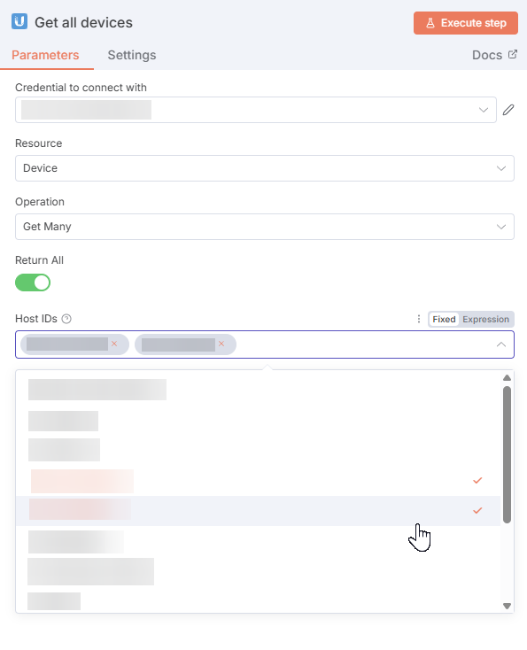
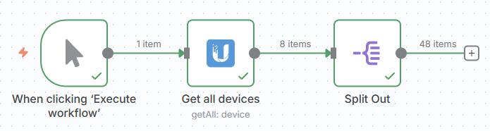
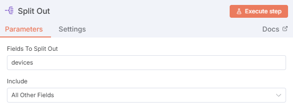

# n8n-nodes-unifi-sitemanager

This is an n8n community node. It lets you use UniFi Site Manager in your n8n workflows.

I built it to test out declarative n8n nodes, but wanted to share it. Shoutout to [r/msp](https://www.reddit.com/r/msp/). You can reach me at [u/j0dan](https://www.reddit.com/user/j0dan/) there.

## Operations

### Hosts
- **Get Many** - Retrieve a list of many hosts associated with your UI account.
- **Get** - Get detailed information about a specific host by ID

### Sites
- **Get Many** - Retrieve a list of many sites from hosts running the UniFi Network application

### Devices  
- **Get Many** - Retrieve a list of UniFi devices managed by hosts where your UI account is owner or super admin
  - Filter by specific host IDs
  - Filter by last processed timestamp. This property is a bit vague and of little utility. It seems to be the last time the Site Manager system got an update regarding this device.

  

### ISP Metrics
- **Get** - This endpoint is in **early access**, but I've included it here so you can try it out without reading the UniFi documentation. It might break in the future or have limited usability, etc.

## Functionality

The **Return All** implements pagination. Be careful if you have a lot of endpoints.

## Credentials
This node uses API key authentication to connect to the UniFi Site Manager API.

For detailed instructions, see the [UniFi Site Manager API Getting Started Guide](https://developer.ui.com/site-manager-api/gettingstarted#obtaining-an-api-key).

## Example Workflow
Recommend using the **Split Out** node on the `devices` field to get a better array for processing.

  

  

## Resources
- [n8n community nodes documentation](https://docs.n8n.io/integrations/#community-nodes)
- [UniFi Site Manager API Documentation](https://developer.ui.com/site-manager-api/gettingstarted)
- [UniFi Developer Console](https://developer.ui.com/)
- [Installation guide for n8n community nodes](https://docs.n8n.io/integrations/community-nodes/installation/)
